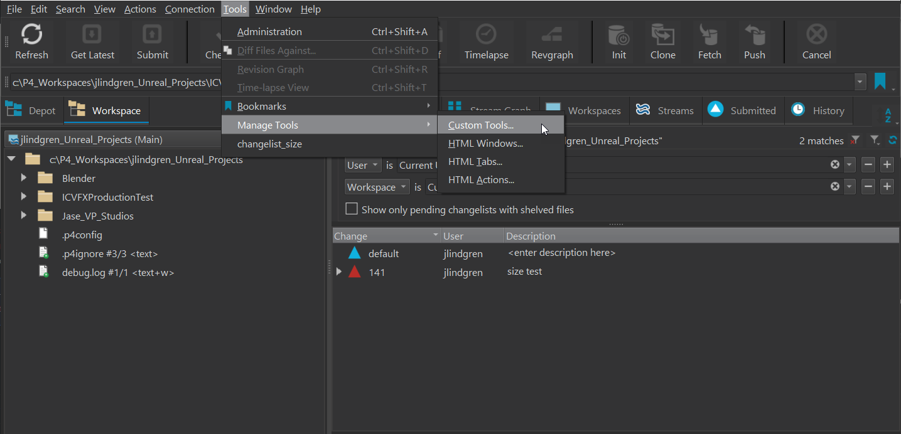
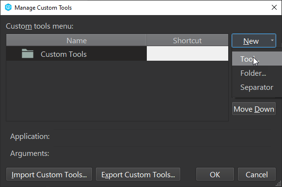
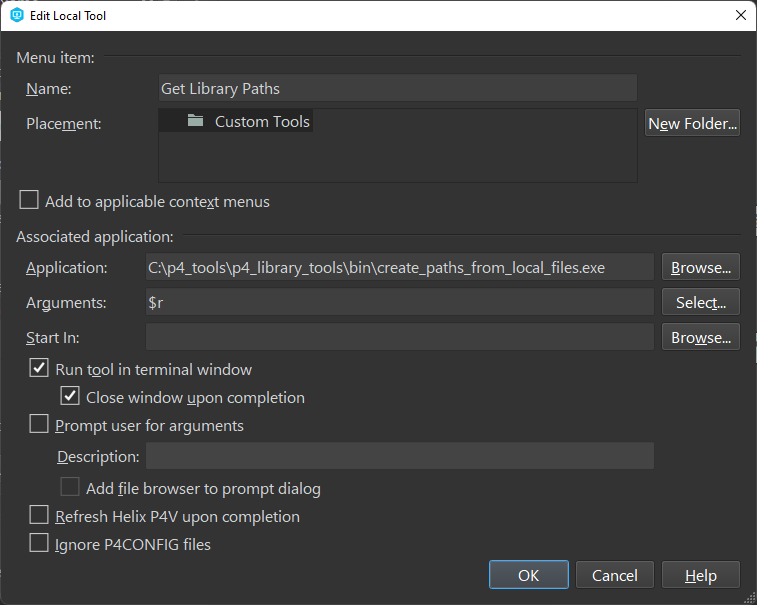
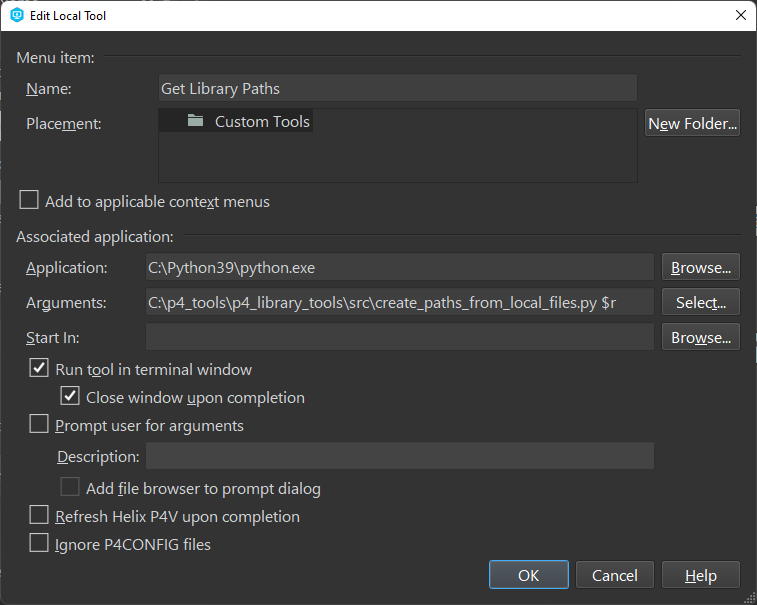
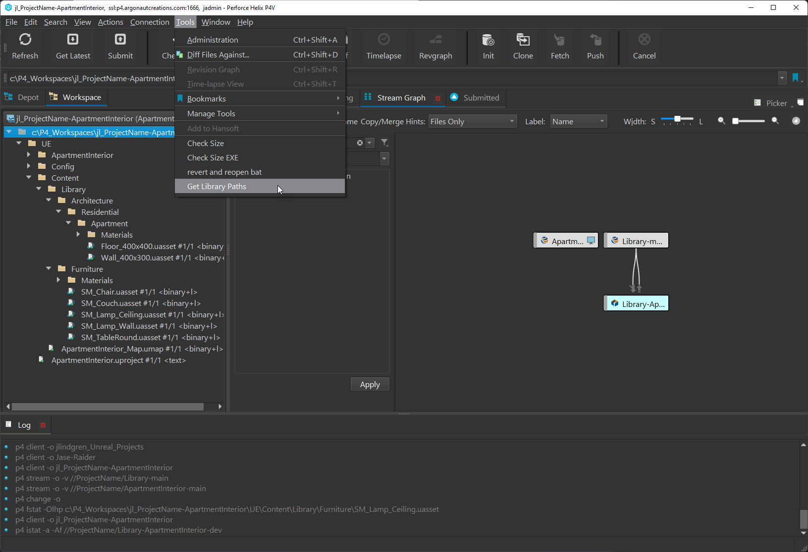

# p4_library_tools
Scripts to save time when using shared libraries between streams in Perforce.

> Note:
   

This script can be setup to run as a [right-click menu item in P4V](#P4V-Setup-and-Usage) or as a [command line tool](#Command-Line-Usage).

## Pre-requisites
You must have the P4 command line client installed and have a Perforce server running.

If you are on Windows then you can use the precompiled EXE file in `bin/` if the pre-configured paths work for you (see CONFIGURING below).

If you want to customize the script or are on another operating system, you will need to have Python 3 installed, as well as:
   - `p4python`: The Perforce Python API.

You can install this module using the following command from the `p4_library_tools` directory:

      pip install -r requirements.txt

## Configuring
Near the top of the python file `src/create_paths_from_local_files.py` there is a section of globals that can be adjusted to fit your folder structure.

1. `MAIN_LIBRARY_PATH` is the relative path to the library folder inside your Library-main stream. This path is used to generate the paths in the output. This is the default:
   ```
   MAIN_LIBRARY_PATH = "Library/UE/Content/Library"
   ```
2. `LOCAL_LIBRARY_PATH` is the relative path to the library folder inside your local workspace. The script takes your workspace root and combines it with this path in order to search for local folders that need to be synced to the library. This is the default: 
   ```
   LOCAL_LIBRARY_PATH = "UE/Content/Library"
   ```

## Usage
There are two ways to use this script. 
1. As a standalone tool: You can simply run the python file or the exe. It will prompt you to enter the root directory for your local workspace. 
2. As a custom tool inside of P4V: By setting up the tool in P4V, you can quickly run it on your active workspace via the Tools... menu and the workspace directory will be set automatically.

## P4V Setup and Usage
1. In p4v, go to `Tools` -> `Manage Tools` -> `Custom Tools`
   
2. In the Custom Tools Window, select `New` -> `Tool...`
   
3. Fill out the highlighted fields EXE or Python usage:
   
   **If using the EXE file**:
   

   **If using the Python file** (Note that the `Application` field is the path to your Python installation and the `Arguments` field is the path to the script plus the `$r` variable for the workspace root):
   
4. Click `OK` to save the tool. Now you can use the tool in p4v by selecting it from the Tools menu. (Note: be sure you are in the workspace that you want to run the tool on.)
   
5. This will pop up a terminal window that will give you lines to copy and paste into your stream's Path field for the Library-dev stream.

## Building your own custom EXE
A single standalone exe file can be generated from the python script after customizing it for easier distribution to your team.

1. Install the `pyinstaller` python library:
   ```
   pip install pyinstaller
   ```
2. From the `p4_library_tools` folder run this command:
   ```
   pyinstaller --distpath ./bin -y --clean -F .\src\create_paths_from_local_files.py 
   ```
3. Once it completes, you can find your executable file in the `bin` directory. 
